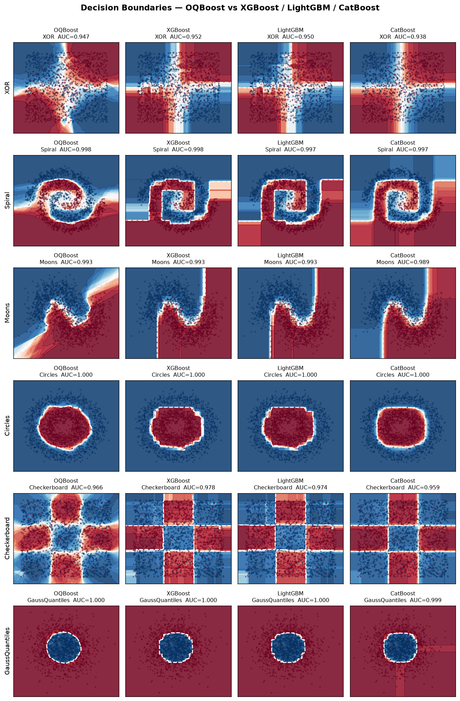

# OQBoost 2.0

**Gradient-boosted 2D-oblique decision trees — histogram-binned, C++ backend.**

OQBoost replaces axis-aligned splits with **oblique hyperplanes over feature pairs**
(`a·u + b·v < t`), capturing diagonal and interaction boundaries that axis-aligned
boosters approximate with coarse staircases. Version 2.0 is a ground-up redesign: a
histogram-binned 2D-oblique core that finds split directions by H-weighted
least-squares regression of the gradient — no random projections, no numerical search.

> **Lineage:** OQBoost 1.x ([cree1116/OQBoost](https://github.com/cree1116/OQBoost))
> found oblique directions with a Deterministic Gradient-Covariance Scan (DGCS).
> 2.0 is a fresh codebase with a different, faster direction finder and a C++ backend.

[](LICENSE)
[](https://www.python.org/)

<p align="center">
  
</p>

Decision boundaries on synthetic 2D problems. OQBoost draws **smooth diagonal**
boundaries (Spiral, XOR) with far fewer splits than the blocky staircases of
axis-aligned boosters.

---

## Key properties

| Feature | OQBoost 2.0 |
|---------|-------------|
| Split type | Oblique — linear combination of **two** features per node |
| Direction finding | H-weighted gradient regression (2×2, O(1)) — deterministic, `fast_dir` |
| Higher-order interactions | Composed via tree depth + boosting (2D atoms) |
| Categorical features | Integer codes through the oblique path (no special encoding) |
| Missing values | Native — NaN routed to a dedicated learned bin (no imputation needed) |
| Speed | Global histogram binning + OpenMP-parallel pair search |
| Tasks | `OQBoostClassifier` (binary + multiclass OvR) · `OQBoostRegressor` |
| API | scikit-learn compatible |
| Backend | Compiled C++ (pybind11) |

---

## Install

```bash
pip install oqboost
```

Building from source needs `clang++`/`g++` (C++17) and, for parallelism, OpenMP
(`brew install libomp` on macOS).

## Quickstart

```python
from oqboost import OQBoostClassifier, OQBoostRegressor

clf = OQBoostClassifier(n_estimators=120, learning_rate=0.06,
                        max_depth=4, subsample=0.8, colsample=0.8)
clf.fit(X_train, y_train)
proba = clf.predict_proba(X_test)[:, 1]

reg = OQBoostRegressor().fit(X_train, y_train)
yhat = reg.predict(X_test)
```

Both are drop-in scikit-learn estimators (`get_params`/`set_params`/`clone`,
Pipelines, GridSearchCV).

---

## Benchmark

Optuna-tuned (each model gets the same trial budget), diverse OpenML binary datasets,
held-out test metrics. Reproduce with:

```bash
python scripts/optimize.py 30 12     # tune all 4 models → docs/optuna_params.json
python scripts/benchmark.py          # evaluate from cached params
```

Tuning (`optimize.py`) and evaluation (`benchmark.py`) are separate; best params are
cached to `docs/optuna_params.json` and reused, so the table below is reproducible.

<p align="center">
  
</p>

Across 12 OpenML binary datasets (each model independently Optuna-tuned):

| Model | mean AUC rank | outright wins | mean AUC |
|-------|--------------:|--------------:|---------:|
| **OQBoost** | **2.17** | **5 / 12** | **0.9047** |
| CatBoost | 2.33 | 2 | 0.9036 |
| XGBoost | 2.50 | 3 | 0.9040 |
| LightGBM | 3.00 | 2 | 0.9009 |

OQBoost ranks **first on mean AUC rank, mean AUC, and number of wins**, ahead of
CatBoost, XGBoost and LightGBM. It is strongest on oblique/interaction structure — on the 2D
synthetic problems (XOR, Spiral, Checkerboard) all boosters reach comparable AUC, but OQBoost
draws **smooth diagonal boundaries** with far fewer splits where axis-aligned trees produce
blocky staircases (see figure above). On **Spiral** OQBoost reaches AUC ≈ 1.000 — the
smoothest boundary of all four boosters.

---

## How it works

1. **Newton boosting** (logistic / squared-error). Per round, fit one oblique tree to
   the gradient/hessian.
2. **Histogram binning** once at fit: per-feature quantile bins precomputed, so node
   split search is sort-free O(n) accumulation.
3. **2D-oblique split**: for each feature pair, find the direction by H-weighted
   least-squares regression of the Newton target (`-g/h`) on the two raw features
   (one 2×2 solve), then scan the projection for the threshold. Best of 1D vs 2D by gain.
4. Higher-order interactions come from **depth + boosting**, not wider splits — 2D is
   the bias/variance and search-cost sweet spot.

See [`docs/MODEL.md`](docs/MODEL.md) and [`docs/DESIGN.md`](docs/DESIGN.md).

---

## Key hyperparameters

| Param | Default | Meaning |
|-------|---------|---------|
| `n_estimators` | 120 | boosting rounds |
| `learning_rate` | 0.06 | shrinkage |
| `max_depth` | 4 | interaction depth |
| `max_bins` | 16 | grid / direction-seed resolution (keep small) |
| `subsample` | 0.8 | rows per tree |
| `colsample` | 0.8 | features per node |
| `reg_lambda` | 1.0 | L2 |
| `n_screen` | -1 | SIS top-m feature screening (-1 = exhaustive) |

---

## License

MIT.