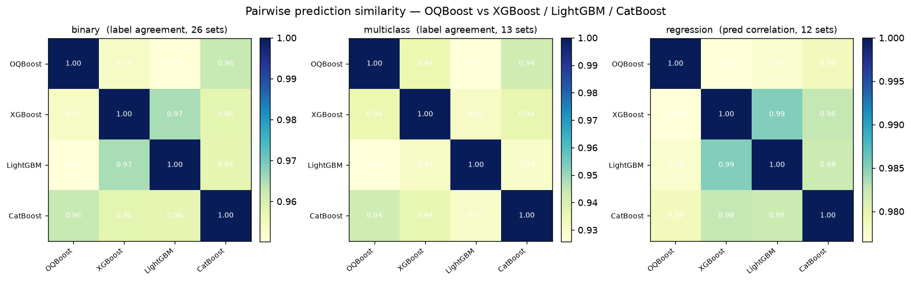

# OQBoost 2.0

**Gradient-boosted 2D-oblique decision trees — histogram-binned, C++ backend.**

OQBoost uses **oblique splits over feature pairs** (`a·u + b·v < t`) instead of
axis-aligned thresholds, so diagonal and interaction boundaries are represented
directly rather than as axis-aligned approximations. Version 2.0 is a histogram-binned
2D-oblique core that finds split directions by H-weighted least-squares regression of
the gradient (no random projections or numerical search), with a C++ backend.

> **Lineage:** OQBoost 1.x ([cree1116/OQBoost](https://github.com/cree1116/OQBoost))
> found oblique directions with a Deterministic Gradient-Covariance Scan (DGCS).
> 2.0 is a fresh codebase with a different, faster direction finder and a C++ backend.

[](https://pypi.org/project/oqboost/)
[](https://pypi.org/project/oqboost/)
[](LICENSE)
[](https://github.com/CREE1116/oqboost-2.0/actions/workflows/wheels.yml)

<p align="center">
  
</p>

Decision boundaries on synthetic 2D problems. Because splits are oblique, OQBoost
represents diagonal boundaries (Spiral, XOR) directly rather than approximating
them with axis-aligned steps.

---

## Key properties

| Feature                   | OQBoost 2.0                                                            |
| ------------------------- | ---------------------------------------------------------------------- |
| Split type                | Oblique — linear combination of **two** features per node              |
| Direction finding         | H-weighted gradient regression (2×2, O(1)) — deterministic, `fast_dir` |
| Higher-order interactions | Composed via tree depth + boosting (2D atoms)                          |
| Categorical features      | Integer codes through the oblique path; `categorical_features` gives marked columns lossless binning |
| Missing values            | Native — NaN routed to a dedicated learned bin (no imputation needed)  |
| Speed                     | Global histogram binning + OpenMP-parallel pair search                 |
| Tasks                     | `OQBoostClassifier` (binary + multiclass OvR) · `OQBoostRegressor`     |
| API                       | scikit-learn compatible                                                |
| Backend                   | Compiled C++ (pybind11)                                                |

---

## Install

```bash
pip install oqboost
```

Prebuilt wheels are provided for Windows, macOS (arm64), and Ubuntu/Linux via
cibuildwheel. Building from source needs `clang++`/`g++` (C++17) and, for
parallelism, OpenMP (`brew install libomp` on macOS).

## Quickstart

```python
from oqboost import OQBoostClassifier, OQBoostRegressor

clf = OQBoostClassifier(n_estimators=120, learning_rate=0.06,
                        max_depth=4, subsample=0.8, colsample=0.8)
clf.fit(X_train, y_train)
proba = clf.predict_proba(X_test)[:, 1]

reg = OQBoostRegressor().fit(X_train, y_train)
yhat = reg.predict(X_test)
```

Both are drop-in scikit-learn estimators (`get_params`/`set_params`/`clone`,
Pipelines, GridSearchCV).

---

## Benchmark

Optuna-tuned (each model gets the same trial budget), diverse OpenML datasets across
**binary, multiclass, and regression** tasks, held-out test metrics. Reproduce with:

```bash
python scripts/optimize.py 30 10     # tune all 4 models × 3 task suites → docs/optuna_params.json
python scripts/benchmark.py          # evaluate from cached params
# limit to one task type:  python scripts/optimize.py 30 10 --tasks=regression
```

Tuning (`optimize.py`) and evaluation (`benchmark.py`) are separate; best params are
cached to `docs/optuna_params.json` and reused. Metrics per task: binary/multiclass use
ROC-AUC (OvR macro for multiclass) plus accuracy / balanced accuracy (decision threshold
tuned on validation, uniformly across models); regression uses R² / RMSE / MAE.

<p align="center">
  
</p>

Across 32 OpenML datasets (each model independently Optuna-tuned). **Mean rank** of
the primary metric per task (1 = best; ROC-AUC for classification, R² for regression),
with outright wins in parentheses:

| Task (datasets)     |       OQBoost |  CatBoost |  XGBoost | LightGBM |
| ------------------- | ------------: | --------: | -------: | -------: |
| Binary (12)         | **1.92** (7)  | 2.50 (3)  | 2.38 (2) | 3.21 (0) |
| Multiclass (10)     |     2.50 (4)  | **2.10** (3) | 2.70 (1) | 2.70 (2) |
| Regression (10)     |     1.90 (4)  | **1.60** (5) | 3.30 (1) | 3.20 (0) |

OQBoost is competitive with the established gradient-boosting libraries across all
three task types — it leads the binary suite on mean rank and wins, and lands a close
second to CatBoost on multiclass and regression. On the classification suites it also
has the best mean balanced accuracy (binary 0.851, multiclass 0.830). Differences are
generally small and tuning/dataset dependent; treat this as one reproducible snapshot,
not a definitive ranking. Where the oblique structure helps most is interaction-heavy
problems — see the 2D synthetic boundaries above.

### Prediction similarity

How much does OQBoost agree with the axis-aligned boosters? Pairwise prediction
similarity across the tuned suites — **label agreement** for classification, **Pearson
correlation of predictions** for regression (`python scripts/model_similarity.py --full`):

<p align="center">
  
</p>

| Binary (26)  | OQBoost | XGBoost | LightGBM | CatBoost |
| ------------ | ------: | ------: | -------: | -------: |
| **OQBoost**  |  1.000  |  0.953  |   0.950  |   0.963  |
| **XGBoost**  |  0.953  |  1.000  |   0.965  |   0.958  |
| **LightGBM** |  0.950  |  0.965  |   1.000  |   0.957  |
| **CatBoost** |  0.963  |  0.958  |   0.957  |   1.000  |

| Multiclass (13) | OQBoost | XGBoost | LightGBM | CatBoost |
| --------------- | ------: | ------: | -------: | -------: |
| **OQBoost**     |  1.000  |  0.935  |   0.926  |   0.943  |
| **XGBoost**     |  0.935  |  1.000  |   0.930  |   0.936  |
| **LightGBM**    |  0.926  |  0.930  |   1.000  |   0.930  |
| **CatBoost**    |  0.943  |  0.936  |   0.930  |   1.000  |

| Regression (12) | OQBoost | XGBoost | LightGBM | CatBoost |
| --------------- | ------: | ------: | -------: | -------: |
| **OQBoost**     |  1.000  |  0.977  |   0.978  |   0.979  |
| **XGBoost**     |  0.977  |  1.000  |   0.985  |   0.983  |
| **LightGBM**    |  0.978  |  0.985  |   1.000  |   0.982  |
| **CatBoost**    |  0.979  |  0.983  |   0.982  |   1.000  |

The axis-aligned trio (XGBoost / LightGBM / CatBoost) agree most tightly with each
other, while OQBoost sits slightly further from all three — it learns a somewhat
different function thanks to the oblique splits, which makes it a useful **diversifier**
in an ensemble.

---

## How it works

1. **Newton boosting** (logistic / squared-error). Per round, fit one oblique tree to
   the gradient/hessian.
2. **Histogram binning** once at fit: per-feature quantile bins precomputed, so node
   split search is sort-free O(n) accumulation.
3. **2D-oblique split**: for each feature pair, find the direction by H-weighted
   least-squares regression of the Newton target (`-g/h`) on the two raw features
   (one 2×2 solve), then scan the projection for the threshold. Best of 1D vs 2D by gain.
4. Higher-order interactions come from **depth + boosting**, not wider splits — 2D is
   the bias/variance and search-cost sweet spot.

See [`docs/MODEL.md`](docs/MODEL.md) and [`docs/DESIGN.md`](docs/DESIGN.md).

---

## Explainability

Because every split is a 2D oblique combination, OQBoost exposes **native**
explanations rather than copying TreeSHAP (which assumes axis-aligned trees):

```python
clf.feature_importances_       # Σ gain per feature (sklearn-standard)
clf.coefficient_importances_   # Σ gain·|coef| per feature (direction-weighted)
clf.interaction_importances_   # d×d matrix, Σ gain·|a|·|b| — learned feature pairs
phi = clf.explain(X)           # (n, n_features) additive per-sample contributions
```

`explain(X)` is **additive** like SHAP — `phi.sum(axis=1)` equals the raw
prediction minus the base score — so it lines up directly with `shap` values
from other models, while `interaction_importances_` reads off the pairwise
structure the oblique splits actually learned (at zero extra cost). `explain(X)`
covers binary classification and regression; for multiclass (one-vs-rest) the
per-class attribution is ambiguous, so it is not provided there.

`oqboost.plot` renders these with matplotlib (no `shap` dependency):

```python
import oqboost.plot as oqp
oqp.plot_importance(model)            # Σ gain·|coef| per feature
oqp.plot_interactions(model)          # d×d pairwise-interaction heatmap
oqp.plot_explanation(model, x)        # one-sample additive contributions
oqp.plot_explanation_summary(model, X)  # SHAP-style beeswarm over samples
```

<p align="center">
  
</p>

On data with a true `age·income` interaction plus independent `capital`/`debt`
linear terms, the heatmap surfaces `age×income`. It also pairs `capital×debt`:
oblique trees fold two independent linear effects into a single direction
`a·capital + b·debt`, so `interaction_importances_` reflects **features co-used
in a split** — genuine interactions and efficient linear combinations alike.

Reproduce with `python scripts/explain_demo.py`.

---

## Serialization

Models are pickle / joblib compatible out of the box (C++ state is serialized via the
wrapper's `__getstate__`/`__setstate__`):

```python
import pickle, joblib
pickle.dump(clf, open("clf.pkl", "wb"))
clf2 = pickle.load(open("clf.pkl", "rb"))
joblib.dump(clf, "clf.joblib")
```

---

## Key hyperparameters

| Param                  | Default     | Meaning                                                                                                                         |
| ---------------------- | ----------- | ------------------------------------------------------------------------------------------------------------------------------- |
| `n_estimators`         | 120         | boosting rounds                                                                                                                 |
| `learning_rate`        | 0.06        | shrinkage                                                                                                                       |
| `max_depth`            | 4           | interaction depth                                                                                                               |
| `max_bins`             | 16          | grid / direction-seed resolution (keep small)                                                                                   |
| `subsample`            | 0.8         | rows per tree                                                                                                                   |
| `colsample`            | 0.8         | features per node                                                                                                               |
| `reg_lambda`           | 1.0         | L2                                                                                                                              |
| `n_screen`             | -1          | SIS top-m feature screening (-1 = exhaustive)                                                                                   |
| `threshold`            | `"0.5"`     | binary decision cut — `"balanced"`/`"f1"` tunes it on a holdout (helps imbalanced data; probabilities stay calibrated)          |
| `loss`                 | `"squared"` | regression loss — `"huber"`/`"quantile"` are outlier-robust (init = median)                                                     |
| `alpha`                | 0.9         | huber: residual quantile for the δ transition · quantile: target quantile                                                       |
| `clip`                 | `False`     | clamp regression output to the training target range (no extrapolation blow-up)                                                 |
| `monotone_constraints` | `None`      | per-feature monotonicity `-1`/`0`/`+1` (list of length `n_features` or `{idx: dir}` dict) — enforced through the oblique splits |
| `warm_start`           | `False`     | reuse existing trees and only add the new ones when `n_estimators` grows (incremental training)                                 |
| `categorical_features` | `None`      | indices / bool mask of categorical columns → lossless binning (one bin per level, ignoring `max_bins`)                          |

---

## License

MIT.
