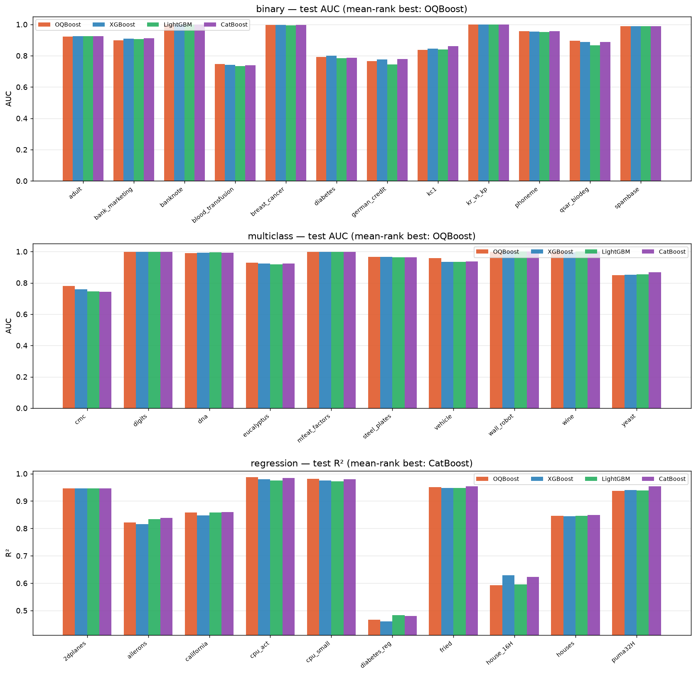
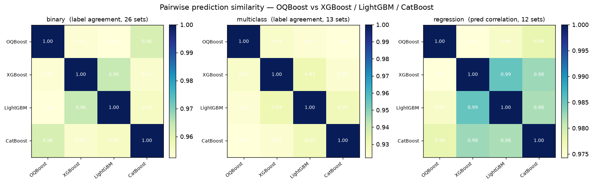

# Benchmarks

Each model (OQBoost / XGBoost / LightGBM / CatBoost) is independently Optuna-tuned
on the same trial budget, across diverse OpenML datasets spanning **binary,
multiclass, and regression** tasks, then evaluated on held-out test data.

```bash
python scripts/optimize.py 30 10     # tune all 4 models x 3 task suites -> docs/optuna_params.json
python scripts/benchmark.py          # evaluate from cached params
# one task only: python scripts/optimize.py 30 10 --tasks=regression
```

Tuning (`optimize.py`) and evaluation (`benchmark.py`) are separate; best params
are cached and reused so the tables below are reproducible. Native categorical
handling is enabled per library for a fair comparison.

<p align="center">
  
</p>

## Mean rank (1 = best), wins in parentheses

Primary metric per task: ROC-AUC for classification (OvR macro for multiclass),
R² for regression.

| Task (datasets) | OQBoost | CatBoost | XGBoost | LightGBM |
| --------------- | ------: | -------: | ------: | -------: |
| Binary (12)     | **2.08** (6) | 2.33 (4) | 2.29 (2) | 3.29 (0) |
| Multiclass (10) | **2.20** (5) | 2.40 (2) | 2.70 (1) | 2.70 (2) |
| Regression (10) | 2.50 (2) | **1.40** (6) | 3.20 (1) | 2.90 (1) |

OQBoost leads **both classification suites** on mean rank and wins, and lands
second to CatBoost on regression. It also has the best mean balanced accuracy on
both classification suites. Differences are generally small and tuning/dataset
dependent — treat this as one reproducible snapshot, not a definitive ranking.
Where the oblique structure helps most is interaction-heavy problems.

## Prediction similarity

How much does OQBoost agree with the axis-aligned boosters? Pairwise prediction
similarity — label agreement for classification, prediction correlation for
regression (`python scripts/model_similarity.py --full`):

<p align="center">
  
</p>

The axis-aligned trio (XGB / LGB / Cat) cluster tightly (~0.96–0.985) while
OQBoost sits slightly apart (~0.95–0.98) — it learns a somewhat different function
(oblique splits) and works as an **ensemble diversifier**.

## Decision boundaries

<p align="center">
  
</p>

On 2D synthetic problems OQBoost represents diagonal boundaries (Spiral, XOR)
directly rather than as axis-aligned steps — the same holds for multiclass
regions (see [`images/decision_boundary_multiclass.png`](images/decision_boundary_multiclass.png)).
