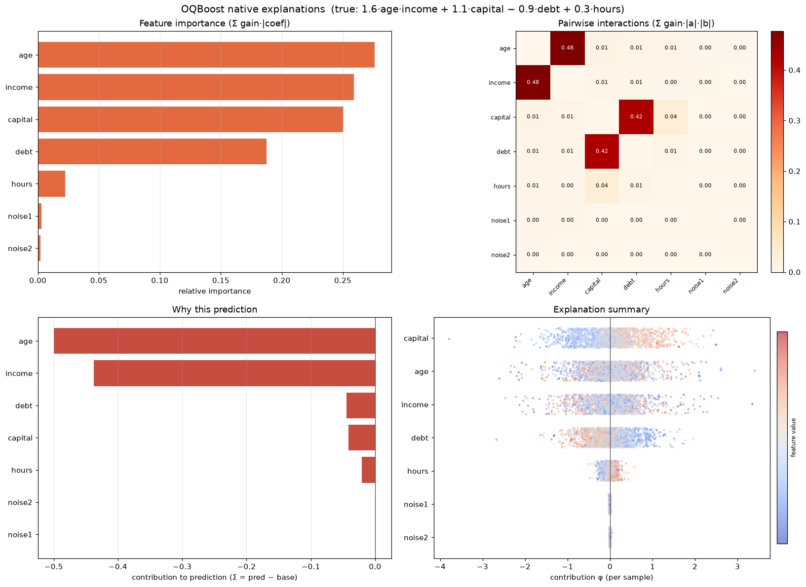

# Explainability

Because every split is a 2D oblique combination, OQBoost exposes **native**
explanations rather than copying TreeSHAP (which assumes axis-aligned trees).

```python
clf.feature_importances_       # sum of gain per feature
clf.coefficient_importances_   # sum of gain*|coef| per feature (direction-weighted)
clf.interaction_importances_   # d x d matrix, sum of gain*|a|*|b| — learned feature pairs
phi = clf.explain(X)           # additive per-sample contributions
```

## `explain(X)` — additive attributions

`explain(X)` distributes each tree's contribution (`lr * leaf_weight`) over the
features on the sample's path, weighted by `gain * |coef|`. The result is
**additive like SHAP**: `phi.sum(axis=-1)` equals the raw prediction minus the
base score, so it lines up directly with `shap` values from other models.

- Binary / regression: shape `(n_samples, n_features)`.
- Multiclass: requires `multiclass="ovr"` → shape `(n_samples, n_classes,
  n_features)`, `[:, k, :]` are the contributions to class `k`'s score. The
  default `joint` model shares one tree across classes, so per-class path
  attribution is undefined and `explain()` raises.
- Not available when `max_lineage > 0` (LOB's composed directions have no
  path-additive attribution).

Validated against KernelSHAP and TreeSHAP: global importance rankings agree at
Spearman ~0.71–0.77; per-sample agreement is moderate (the gain-share allocation
is not exact Shapley but tracks it).

## `interaction_importances_` — learned feature pairs

A `d x d` upper-triangular matrix accumulated at fit (zero extra cost). `[i, j]`
is the strength of the oblique pairing of features `i` and `j`. Note this reflects
**features co-used in a split** — both genuine interactions and efficient linear
combinations of two main effects.

## Plotting

`oqboost.plot` renders these with matplotlib (no `shap` dependency); see the
[plotting API](api/plotting.md).

```python
import oqboost.plot as oqp
oqp.plot_importance(model)              # gain / gain*|coef| bar
oqp.plot_interactions(model)            # interaction heatmap
oqp.plot_explanation(model, x)          # one-sample additive contributions
oqp.plot_explanation_summary(model, X)  # SHAP-style beeswarm
```

For multiclass `ovr` models every plot takes `class_idx=k` to view one class
(per-class explanation requires `multiclass="ovr"`).

<p align="center">
  
</p>
